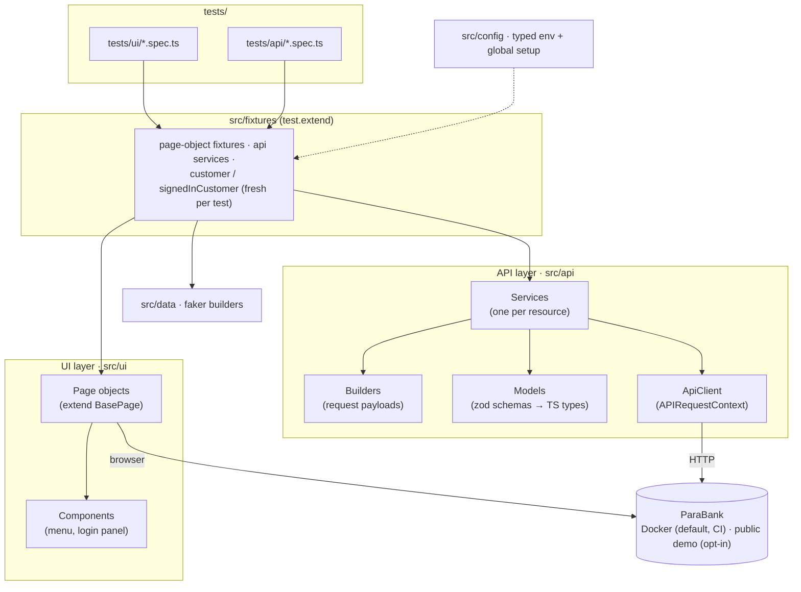
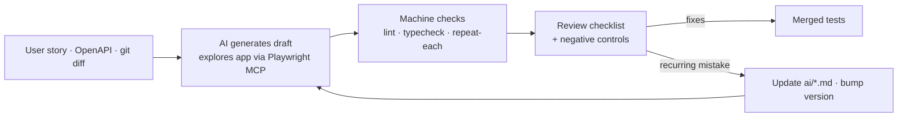

# Playwright AI-Assisted Test Framework

[](https://github.com/viengiang/playwright-ai-assisted-framework/actions/workflows/ci.yml)
[](LICENSE)

- **Test framework:** Playwright + TypeScript for a demo banking app (ParaBank). It covers UI and REST API, with page objects, typed API models and runtime schema validation.
- **Deterministic by design:** every test creates its own data, compares money in cents, and runs in CI against an isolated Docker instance per shard.
- **Human-in-the-loop AI workflow:** Playwright MCP plus versioned instructions produce test drafts. A review checklist with negative controls decides what gets merged.
- **Evidence:** a [worked example](docs/ai-workflow-example.md) where the review caught what CI didn't, and [real defects](docs/KNOWN-ISSUES.md) found in the app under test.

---

## Contents

- [Architecture](#architecture)
- [Running the tests](#running-the-tests)
- [What is tested](#what-is-tested)
- [Design decisions and trade-offs](#design-decisions-and-trade-offs)
- [AI-assisted testing workflow](#ai-assisted-testing-workflow)
- [Applying this to a project](#applying-this-to-a-project)
- [Repository layout](#repository-layout)

## Architecture



- **Specs** import `test` and `expect` only from `@fixtures`, and ESLint enforces this. Fixtures hand
  each test its page objects, API services and a newly registered customer.
- **UI tests verify through the API.** After a UI action that moves money, the test checks the
  ledger through the service layer, not just the confirmation banner.
- **The API layer** follows a model / builder / service pattern:
  - zod schemas are both the TypeScript types and the runtime check of every JSON response;
  - builders produce valid request payloads;
  - services expose `x()` (parsed, typed, throws on non-2xx) and `xResponse()` (raw, for
    negative tests).

## Running the tests

**Prerequisites:** Node 22 (`nvm use`), Docker, and Google Chrome (only for Playwright MCP).

```bash
npm ci
npx playwright install chromium firefox webkit
npm run env:up          # local ParaBank on http://localhost:8090 (PARABANK_PORT to change)
npm test                # all projects: api, chromium, firefox, webkit, mobile-chrome
npm run report          # open the HTML report
```

| Script                                           | Runs                                                        |
| ------------------------------------------------ | ----------------------------------------------------------- |
| `npm run test:api`                               | API project only (no browser)                               |
| `npm run test:ui`                                | UI projects (chromium, firefox, webkit, mobile-chrome)      |
| `npm run test:smoke` / `npm run test:regression` | By tag                                                      |
| `npm run test:headed`                            | Chromium, headed                                            |
| `npm run check`                                  | Prettier check, ESLint (`--max-warnings=0`), `tsc --noEmit` |
| `npm run env:up` / `npm run env:down`            | Start/stop the local ParaBank container                     |

**Environments** (see [.env.example](.env.example)):

- `ENV=local` (default) targets the Docker instance.
- `ENV=public` targets `parabank.parasoft.com`. Use it sparingly: the database is shared, and
  Cloudflare challenges bursts of sign-ups.
- `BASE_URL` points the suite at any other ParaBank deployment.

**CI** ([.github/workflows/ci.yml](.github/workflows/ci.yml)) runs on every push and pull request:

1. Format, lint and typecheck.
2. Tests in **4 shards**. Each shard starts its own ParaBank container, so shards never share
   data.
3. A final job merges the shards' blob reports into one HTML report, uploaded as the
   `playwright-html-report` artifact.

In CI, failed tests retry up to twice, and trace, screenshot and video are kept on failure. Runners
are pinned to `ubuntu-24.04`.

## What is tested

18 tests: 8 API and 10 UI. The UI tests run on Chromium, Firefox and WebKit, and the `@smoke`
subset also runs on a mobile viewport, for 42 runs in total.

| Feature      | UI (`tests/ui`)                                                                                                                 | API (`tests/api`)                                                                                                  |
| ------------ | ------------------------------------------------------------------------------------------------------------------------------- | ------------------------------------------------------------------------------------------------------------------ |
| Login        | valid credentials → overview; wrong password → error, still logged out                                                          | wrong password → 400 with message                                                                                  |
| Registration | valid → logged in + profile persisted (API); empty form → every required field flagged; password mismatch → no customer created | registered profile matches schema and input                                                                        |
| Accounts     | open savings account → listed with its balance (verified via API)                                                               | new customer has exactly one checking account; opening an account moves (not creates) money; unknown account → 400 |
| Transfers    | transfer between own accounts → both balances change by the amount (API + overview)                                             | balance deltas + debit/credit ledger entries; unknown source → 400; negative amount → `@known-defect`              |
| Bill Pay     | pays from the chosen account + ledger entry; empty form and account-number mismatch → no payment request sent                   | —                                                                                                                  |

## Design decisions and trade-offs

| Decision                                                                       | Why                                                                                                                                                                                                                                                            | Trade-off                                                                                                                     |
| ------------------------------------------------------------------------------ | -------------------------------------------------------------------------------------------------------------------------------------------------------------------------------------------------------------------------------------------------------------- | ----------------------------------------------------------------------------------------------------------------------------- |
| **One worker per ParaBank instance; scale with CI shards**                     | ParaBank isn't safe for concurrent use: overlapping sign-ups and account creations collide on ids, and view state leaked between sessions ([KNOWN-ISSUES #1](docs/KNOWN-ISSUES.md)). A narrow lock was tried and dropped because it couldn't cover every path. | Local runs are serial (about 30 s for the full suite on a laptop). CI parallelism comes from shards with isolated containers. |
| **Docker by default, public demo opt-in**                                      | Deterministic data, no load on a shared demo, and no Cloudflare challenges.                                                                                                                                                                                    | Contributors need Docker.                                                                                                     |
| **A fresh customer per test, created over HTTP**                               | Full data isolation, with no dependence on seed users that anyone can reset.                                                                                                                                                                                   | Extra setup per test (a sign-up and a login over HTTP, no browser).                                                           |
| **UI tests log in by sharing the sign-up session cookie** (`signedInCustomer`) | Only the login tests exercise the login form. Every other UI test starts on the page it covers.                                                                                                                                                                | The login form itself is covered by its own tests only.                                                                       |
| **Balances compared as deltas, in integer cents**                              | Default balances can change, and floating-point arithmetic would make equality checks flaky.                                                                                                                                                                   | Tests read balances before and after an action.                                                                               |
| **Models follow observed behaviour; spec drift is documented**                 | The OpenAPI spec is wrong in places (`date` is epoch ms, `createAccount` reports balance 0, …), see [SPEC-DRIFT.md](specs/SPEC-DRIFT.md).                                                                                                                      | The models are hand-maintained. The `generate-api-tests` workflow covers this.                                                |
| **Strict schemas** (`z.strictObject`, all properties required)                 | Unexpected or missing fields show up as contract drift.                                                                                                                                                                                                        | A harmless new field fails the schema until the model is updated.                                                             |
| **Locator ladder with documented exceptions**                                  | `getByRole` first. ParaBank's form fields have no accessible names, so `#id` / `[name]` are used there, each with a comment.                                                                                                                                   | Some locators depend on ids. That's a real accessibility finding, not a style choice.                                         |
| **Known defects as `test.fail()` tests**                                       | The suite stays green while still asserting correct behaviour. If ParaBank fixes the bug, Playwright reports an unexpected pass.                                                                                                                               | Needs discipline: every marker links to [KNOWN-ISSUES.md](docs/KNOWN-ISSUES.md).                                              |
| **Rules enforced by tooling**                                                  | `eslint-plugin-playwright` blocks `waitForTimeout`, `waitForSelector`, `networkidle`, `force: true`, focused or skipped tests, conditionals in tests, and importing `test` from anywhere but `@fixtures`.                                                      | Contributors sometimes have to satisfy the linter.                                                                            |

### Findings in the system under test

Building the suite surfaced real ParaBank defects. They are recorded with reproduction steps
rather than worked around:

- Concurrent sign-ups and account creation fail, or return account ids that can't be found afterwards.
- Transfers accept negative amounts and overdrafts.
- Bill Pay with a negative amount _adds_ money to the paying account (found by the AI during the
  demo, then verified independently).
- The spec disagrees with responses in 5 places.

Details: [docs/KNOWN-ISSUES.md](docs/KNOWN-ISSUES.md) · [specs/SPEC-DRIFT.md](specs/SPEC-DRIFT.md).

## AI-assisted testing workflow

AI drafts, humans decide. Versioned instructions in [ai/](ai/README.md) are exposed as Claude Code
commands. [.mcp.json](.mcp.json) gives the agent a real browser through Playwright MCP, so
locators and messages come from what the app renders, not from guesses.



| Workflow                                          | Input              | Output                                           |
| ------------------------------------------------- | ------------------ | ------------------------------------------------ |
| [`/generate-ui-test`](ai/generate-ui-test.md)     | User story         | Page objects, fixtures and UI specs (draft)      |
| [`/generate-api-tests`](ai/generate-api-tests.md) | OpenAPI operations | Models, builders, services and API specs (draft) |
| [`/change-impact`](ai/change-impact.md)           | Git diff           | Affected areas, tests to run, update or add      |
| [`/review-ai-tests`](ai/review-ai-tests.md)       | An AI draft        | Findings table with severities and a verdict     |

**Automated vs. reviewed:**

| Automated (AI + tooling)                                          | Owned by the reviewer                                                   |
| ----------------------------------------------------------------- | ----------------------------------------------------------------------- |
| Exploring the app, writing the first draft, recording exact texts | Deciding which scenarios are worth testing                              |
| Lint, typecheck, repeated runs, cross-browser runs                | Judging whether each assertion proves the behaviour (sensitivity check) |
| Flagging suspected defects with evidence                          | Deciding whether a defect becomes a `@known-defect` test                |
| Proposing changes to the instructions                             | Merging, and versioning the instructions                                |

**Worked example: [docs/ai-workflow-example.md](docs/ai-workflow-example.md).**

- A headless Claude Code run turned a Bill Pay user story into three passing tests and found a
  real money defect along the way.
- The review's reverse negative control showed that the draft's "no payment was made" checks
  caught an actual payment **0/10** times (`toBeHidden()`) and **5/10** times (balance read racing
  the request).
- After the fix they catch it **10/10**.
- The AI draft and the reviewed version are separate commits, and the lesson went back into the
  instructions (v1.1.0).

To use the workflows: open the repo in Claude Code, approve the `playwright` MCP server, run
`npm run env:up`, then use for example `/generate-ui-test As a customer I want to …`. Other agents
can use the files in `ai/` directly with [CLAUDE.md](CLAUDE.md) as context.

## Applying this to a project

1. **Assessment.** Map the critical money and data flows, the existing coverage,
   how environments and test data work, and where flakiness comes from. The output is a short risk
   list and a test strategy (what belongs at the UI level, the API level, or neither).
2. **Framework.** Set up the layers shown here, adapted to the stack: fixtures, page objects and
   typed API services. Add data isolation from day one and turn the conventions into lint rules.
   Start with the smoke path of the highest-risk flow.
3. **CI.** Make runs deterministic before making them fast: isolated environments or data per run,
   sharding, merged reports, and traces on failure. Make flaky tests visible instead of silently
   retrying them.
4. **AI workflow.** Write the repo's conventions as agent instructions, connect Playwright MCP to a
   safe environment, and put the review checklist and negative controls in front of every merge.
   Feed recurring review findings back into the instructions.

## Repository layout

```
.github/workflows/ci.yml   CI: quality → sharded tests → merged report
.claude/commands/          Slash commands wrapping ai/*.md
.mcp.json                  Playwright MCP for AI agents
ai/                        Versioned AI workflows (+ README)
docs/                      Known issues, worked AI example, brief and plan
specs/                     Vendored OpenAPI spec + documented drift
src/
  config/                  Typed env, global setup (readiness + local DB seeding)
  fixtures/                test.extend: pages, API services, per-test customers
  ui/pages, ui/components  Page objects
  api/client, models,      API layer: client, zod models, builders, services
      builders, services
  data/builders            Faker-based test data
  utils/                   Money helpers
tests/ui, tests/api        Specs
docker-compose.yml         Local ParaBank
CLAUDE.md                  Conventions for humans and AI agents
```

## Author

**[Author Name]** · [LinkedIn](https://www.linkedin.com/in/your-profile) · [Portfolio](https://example.com) · [Email](mailto:you@example.com)

Licensed under the [MIT License](LICENSE). ParaBank is a demo application by Parasoft; this
repository is not affiliated with Parasoft.
