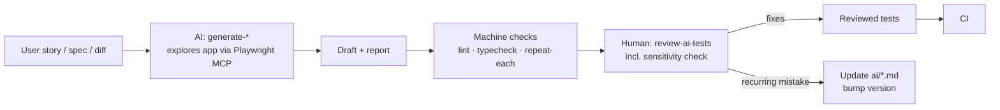

# AI-assisted testing workflows

Reusable, versioned instructions for AI agents working on this repo. Each workflow states its
inputs, steps, the conventions it must follow and an output checklist, so results can be reviewed
against a fixed standard rather than judged case by case.

| Workflow                                    | Input              | Produces                                       |
| ------------------------------------------- | ------------------ | ---------------------------------------------- |
| [generate-ui-test](generate-ui-test.md)     | User story         | Page objects + UI specs (draft)                |
| [generate-api-tests](generate-api-tests.md) | OpenAPI operations | Models, builders, services + API specs (draft) |
| [change-impact](change-impact.md)           | Git diff           | Affected areas, tests to run/update/add        |
| [review-ai-tests](review-ai-tests.md)       | An AI draft        | Findings table + verdict                       |

## Human in the loop

**Automated:** exploring the app, drafting code, running lint, typecheck and repeated runs.
**Human-owned:** deciding what is worth testing, judging whether assertions prove the behaviour,
accepting known-defect markers, and merging.

## Using the workflows

- **Claude Code:** `.claude/commands/` exposes each file as a slash command, e.g.
  `/generate-ui-test As a customer I want to …`. `.mcp.json` provides Playwright MCP (Chrome,
  isolated profile). Approve the `playwright` server when Claude Code asks.
- **Other agents:** give the agent the workflow file and [../CLAUDE.md](../CLAUDE.md) as context.
  The files don't depend on Claude-specific features.

A worked example, including what the AI got wrong and how the review caught it, is in
[docs/ai-workflow-example.md](../docs/ai-workflow-example.md).

## Versioning

Each file has a `version` in its front matter (semver).

- **Patch:** wording and clarifications.
- **Minor:** new steps or checklist items, for example a recurring review finding promoted into the
  generator.
- **Major:** changed inputs or outputs.

Bump `updated` along with the version, and mention the version in commit messages that change a
workflow.
